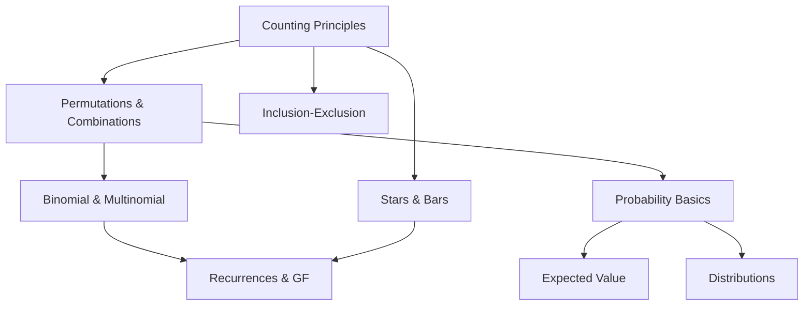

# 🧭 Core Topics

Master the fundamental counting and probability concepts that form the foundation of AMC problems.

## 📚 Topic Overview

### 🔢 Basic Counting
- **[Counting Principles](counting-principles)** - Addition, multiplication, and complement rules
- **[Permutations & Combinations](permutations-combinations)** - Arrangements and selections
- **[Binomial & Multinomial](binomial-multinomial)** - Advanced counting identities

### 🎯 Advanced Counting
- **[Inclusion-Exclusion](inclusion-exclusion)** - Overlapping set counting
- **[Pigeonhole Principle](pigeonhole)** - Bounds and existence proofs
- **[Stars & Bars](stars-and-bars)** - Integer solution counting
- **[Symmetry & Invariance](symmetry-invariance)** - Reducing cases through symmetry

### 🎲 Probability
- **[Probability Basics](probability-basics)** - Conditional probability and independence
- **[Expected Value](expected-value)** - Linearity and indicators
- **[Distributions](distributions)** - Binomial, geometric, and hypergeometric

### 🔄 Advanced Topics
- **[Recurrences & Generating Functions](recurrences-gf)** - AMC 12 advanced techniques

## 🎯 Study Strategy

1. **Start with Basic Counting** - Master the fundamental principles
2. **Practice Permutations & Combinations** - These appear in most problems
3. **Learn Advanced Counting** - Essential for harder AMC problems
4. **Master Probability** - Critical for both AMC 10 and 12
5. **Explore Advanced Topics** - For AMC 12 and challenging problems

## 📊 Topic Dependencies

## 🏆 Contest Tips

- **AMC 10**: Focus on basic counting, permutations/combinations, and simple probability
- **AMC 12**: Add advanced counting techniques, expected value, and distributions
- **Time management**: Use symmetry and complement principles to avoid casework
- **Common traps**: Watch for indistinguishable objects and replacement vs. no-replacement

---

*Start with [Counting Principles](counting-principles) or jump to [Permutations & Combinations](permutations-combinations)*
